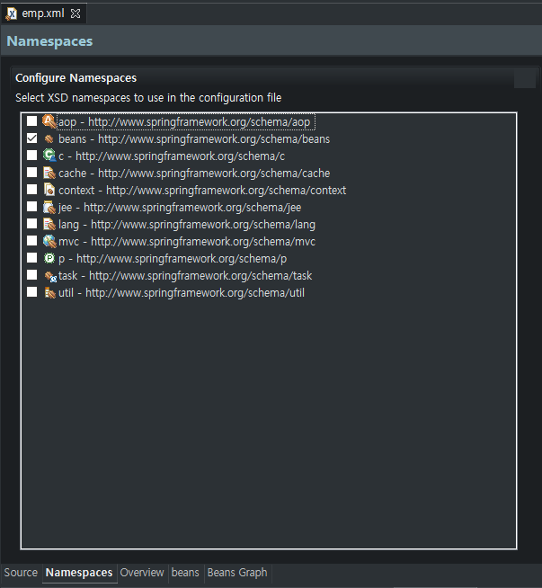

# DI

> DI : Dependency Injection
>
> Spring은 IOC를 두가지 형태로 지원한다.
>
> 1. Dependency Lookup
>    * 컨테이너가 애플리케이션 운용에 필요한 객체를 생성하고 클라이언트는 컨테이너가 생성한 객체를 검색(Lookup)하여 사용하는 방식, 지금까지 우리가 컨테이너를 사용해왔던 방법
> 2. Dependency Injection
>    * 객체 사이의 의존관계를 스프링 설정 파일에 등록된 정보를 바탕으로 컨테이너가 자동으로 처리해주는 방식, 유지보수가 향상되며 실제 개발과정에서 대부분 사용

### Dependency Relation

> 의존 관계에 대하여 알아보기 위하여 3개의 클래스를 이용한다.

* IoC를 공부할 때 사용했던 TV Class이다. 하위 TV들을 만들기 위한 틀이다.

  ```java
  public interface TV {
  	public void powerOn();
		public void powerOff();
		public void soundUp();
		public void soundDown();
  }
  ```

* 하위 TV들에 포함될 SonySpeaker Class를 만들었다.

  ```java
  public class SonySpeaker{
      public SonySpeaker(){
          System.out.println("===> SonySpeaker 객체 생성");
      }
      public void soundUp(){
          System.out.println("SonySpeaker --- Sound Up.");
      }
      public void soundDown(){
          System.out.println("SonySpeaker --- Sound Down");
      }
  }
  ```

* TV를 상속받고 Speaker를 객체로 생성하는 하위 TV 클래스다.

  ```java
  public class SamsungTV implements TV{
      private SonySpeaker speaker;
      
      public SamsungTV(){
          System.out.println("===> SamsungTV 객체 생성");
      }
      public void powerOn(){
        System.out.println("SamsungTV --- Power On");
      }
      public void powerOff(){
          System.out.println("SamsungTV --- Power Off");
      }
      public void soundUp(){
          speaker = new SonySpeaker();
          speaker.soundUp();
      }
      public void soundDown(){
          speaker = new SonySpeaker();
          speaker.soundDown();
      }
  }
  ```

* 다음의 TV Main Class를 실행시켜 본다.

  ```java
  import org.springframework.context.ApplicationContext;
  import org.springframework.context.support.ClassPathXmlApplicationContext;

  public class Main {
  
  	public static void main(String[] args) {
  		ApplicationContext container = new ClassPathXmlApplicationContext("tv.xml");
  		
  		TV tv = container.getBean("tv", TV.class);
  		tv.powerOn();
  		tv.soundUp();
  		tv.soundDown();
  		tv.powerOff();
  	}
  
  }
  
  ```
  
* 두 가지 문제가 있다.

  * SonySpeaker 객체가 쓸데 없이 두개가 생성된다.
  * 다른 Speaker로 변경한다면 soundUP과 soundDown 두 개의 메소드를 모두 수정해야 한다.

* 문제가 발생하는 이유는 의존관계에 있는 Speaker 객체에 대한 객체 생성 코드를 직접 SamsungTV 소스에 명시했기 때문이다.

> 위와 같은 문제를 Spring에서는 의존성 주입(DI)를 이용하여 해결한다.
>
> DI에는 Setter 메소드를 기반으로 하는 Setter Injection과 생성자를 기반으로 하는 Constructor Injection이 있다.

## Constructor Injection

> Spring Container는 xml 설정 파일에 등록된 클래스를 찾아서 객체를 생성할 때 기본적으로 매개변수가 없는 기본 생성자를 호출한다.
>
> 하지만 다른 생성자를 호출하도록 설정할 수 있다. 이를 이용하여 Constructor Injection을 처리한다.

* 생성자의 매개변수로 의존관계에 있는 객체의 주소정보를 전달할 수 있다.

* 위에서 생성한 SamsungTV Class에 생성자를 추가한다.

  ```java
  public SamsungTV(SonySpeaker speaker){
      System.out.println("===> SamsungTV(2) 객체 생성");
          this.speaker = speaker;
  }
  ```

  * 매개변수로 SonySpeaker 객체를 받아서 멤버 변수로 선언된 speaker를 초기화한다.

* 이를 위해서 xml설정을 바꿔줘야 한다.

  ```xml
  <beans>
  	<bean id="tv" class="SamsungTV">
  		<constructor-arg ref="sony"/>
  	</bean>
  
  	<bean id="sony" class="SonySpeaker"/>
  </beans>
  ```

  * `<constructor-arg>`를 이용하여 생성자의 매개변수 정해주었다.
  * 이를 이용하여 TV Main Code를 실행하면 SonySpeaker의 객체가 먼저 생성되며 이후에 SamsungTV의 두번째 생성자가 사용된 것을 확인할 수 있다.

### Multivariable Mapping

> Contructor Injection에서 초기화해야 할 멤버변수가 여러 개라면, 여러 개의 값을 한꺼번에 전달해야 한다.

* 위에서 사용한 SamsungTV Class에 다음의 코드를 추가한다.

  ```java
  private int price;
  
  public SamsungTV(SonySpeaker speaker, int price){
      System.out.println("===> SamsungTV(3) 객체 생성");
      this.speaker = speaker;
      this.price = price;
  }
  public void powerOn(){
      System.out.println("SamsungTV --- Power On. (Price: " + price + ")");
  }
  ```

* 그리고 xml파일에 `<contructor-arg>` Element를 매개변수의 개수만큼 추가해야 한다.

  ```xml
  <beans>
  	<bean id="tv" class="SamsungTV">
      	<constructor-arg ref="sony"/>
          <constructor-arg value="2700000"/>
      </bean>
  </beans>
  ```

  * 객체를 매개변수로 받을 때는 ref속성을 사용하며 고정된 문자열이나 정수 같은 기본형 데이터일 때는 value속성을 사용한다.

* 생성자가 여러 개 오버로딩 되어있다면 어떤 생성자를 호출해야 할지 분명하지 않을 수 있다.

  * 이를 위해 index 속성을 지원하며 이를 이용하면 어떤 값이 몇 번째 매개변수로 매핑되는지 지정할 수있다.

    ```xml
    <constructor-arg index="0" ref="sony"/>
    <constructor-arg index="1" value="2700000"/>
    ```

* 다른 Speaker를 사용하는 경우에는 해당 Speaker의 객체를 `<bean>`을 이용하여 생성한 후 ref속성의 값만 변경해주면 된다.

## Setter Injection

> Setter 메소드를 호출하여 DI를 처리하는 방법
>
> Constructor Injection과 결과가 같으므로 둘 중 어떤 방법을 쓰든 상관없으나 코딩 컨벤션에 따라 한 가지로 통일해서 사용한다. 대부분은 Setter Injection을 사용하며, Setter 메소드가 제공되지 않는 클래스에 대해서만 Constructor Injection을 사용한다.

* SamsungTV Class에 Setter 메소드를 추가한다.

  ```java
  public void setSpeaker(SonySpeaker speaker){
      System.out.println("===> setSpeaker() 호출");
      this.speaker = speaker;
  }
  public void setPrice(int price){
      System.out.println("===> setPrice() 호출");
      this.price = price;
  }
  ```

  * Setter 메소드는 Spring Container가 자동으로 호출하며, 호출하는 시점은 `<bean>` 객체 생성 직후다.
    * 따라서 Setter Injection이 동작하려면 Setter 메소드뿐만 아니라 기본생성자도 반드시 필요하다.

* xml파일에 `<constructor-arg>`가 아닌 `<property>`를 추가한다.

  ```xml
  <beans>
  	<bean id="tv" class="SamsungTV">
      	<property name="speaker" ref="sony"/>
          <property name="price" value="2700000"/>
      </bean>
      
      <bean id="sony" class="SonySpeaker"/>
  </beans>
  ```

  * Setter Injection에서는 `<property>` Element를 사용해야하며 name속성값이 호출하고자 하는 메소드 이름이다.
    * name속성값은 Setter 메소드명에서 가져와야 하며, 앞의 set을 제외하고 맨 앞 글자를 소문자로 바꾼 문자열이 name값이 되어야 한다.
    * 지금처럼 `setSpeaker()`를 호출하기 위해서는 set을 빼고 S를 소문자로 바꾼 speaker가 된다.
  * 첫문자가 아닌 뒤의 문자들은 소문자가 와도 상관없다. 중요한건 Setter 메소드와 연결되어야 한다.
  * `<constructor-arg>`를 사용할 때와 같이 객체를 인자로 넘기려면 ref속성을 사용하고 기본형 데이터를 넘기려면 value속성을 사용한다.

### p Namespace

> Setter Injection을 설정할 때 p Namespace를 이용하면 효율적으로 의존성 주입을 처리할 수 있다.

* Eclipse에서 진행한다면, xml파일의 하단부를 살펴보면 Namespace 탭이 보인다.

  

* 해당 Namespace 탭에서 p의 체크박스에 체크를 하면 xml에 자동으로 p Namespace가 추가된다.

  ```xml
  <beans xmlns="http://www.springframework.org/schema/beans"
         xmlns:xsi="http://www.w3.org/2001/XMLSchema-instance"
         xmlns:p="http://www.springframework.org/schema/p"
         xsi:schemaLocation="http://www.springframework.org/schema/beans http://www.springframework.org/schema/beans/spring-beans.xsd">
  </beans>
  ```

  * `xmlns:p=`가 추가된것을 확인할 수 있다.

* p Namespace를 추가했다면 이는 다음과 같이 사용한다.

  ```xml
  <bean id="tv" class="SamsungTV" p:speaker-ref="sony" p:price="2700000"/>
  <bean id="sony" class="SonySpeaker"/>
  ```

  * 객체를 참조하기 위해서는 `p:변수명-ref=""`와 같이 사용한다.
  * 기본형 데이터를 설정할 때는 `p:변수명=""`와 같이 사용한다.

## Collection 객체 설정

> 배열이나 List와 같은 Collection 객체를 이용하여 데이터 집합을 사용하는 경우가 있다.
>
> Collection 객체를 의존성 주입하면 되는데 이를 위해 다음과 같은 Element를 지원한다

| Collection Type       | Element   |
| --------------------- | --------- |
| java.util.List, Array | `<list>`  |
| java.util.Set         | `<set>`   |
| java.util.Map         | `<map>`   |
| java.util.Properties  | `<props>` |

* List 타입은 다음과 같이 사용한다.

  ```java
  private List<String> addressList;
  
  public void setAddressList(List<String> addressList){
      this.addressList = addressList;
  }
  ```

  * 위와 같이 List에 대한 setter 메소드가 있을 때 xml설정파일은 다음과 같다.

    ```xml
    <bean id="collection" class="{className}">
    	<property name="addressList">
        	<list>
            	<value>서울시 강남구 역삼동</value>
                <value>서울시 성동구 행당동</value>
            </list>
        </property>
    </bean>
    ```

* set 타입의 xml 설정은 다음과 같다

  ```xml
  <bean id="collection" class="{className}">
  	<property name="addressList">
      	<set value-type="java.lang.String">
          	<value>서울시 강남구 역삼동</value>
              <value>서울시 성동구 행당동</value>
              <value>서울시 성동구 행당동</value>
          </set>
      </property>
  </bean>
  ```

  * Set 타입이므로 서울시 성동구 행당동은 한번만 들어가게 될 것이다.

* Map 타입의 xml 설정은 다음과 같다.

  ```xml
  <bean id="collection" class="{className}">
  	<property name="addressList">
      	<map>
          	<entry>
              	<key><value>고길동</value></key>
                  <value>서울시 강남구 역삼동</value>
              </entry>
              <entry>
              	<key><value>마이콜</value></key>
                  <value>서울시 강서구 화곡동</value>
              </entry>
          </map>
      </property>
  </bean>
  ```

  * `<entry>` Element에 사용된 `<key>` Element는 map객체의 key값을 설정한다.
  * `<entry>` Element에 사용된 `<value>` Element는 map객체의 value값을 설정한다.

* Properties 타입의 xml 설정은 다음과 같다.

  ```xml
  <bean id="collection" class="{className}">
  	<property name="addressList">
      	<probs>
          	<prop key="고길동">서울시 강남구 역삼동</prop>
              <prop key="마이콜">서울시 강서구 화곡동</prop>
          </probs>
      </property>
  </bean>
  ```