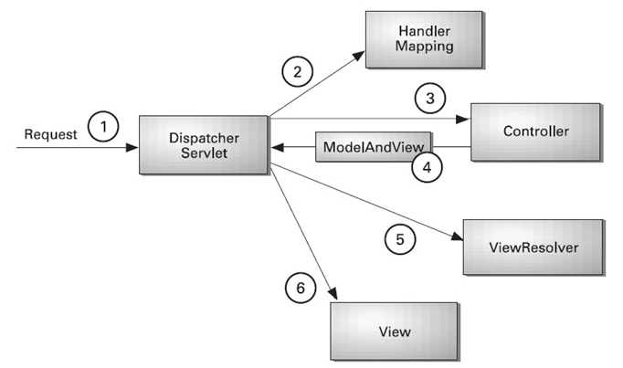

# MVC

> M(Model) - V(View) - C(Controller)

* Model - 용어 / 개념 (View를 보여주기 위한 도구같은 느낌)
* View - 보여줄 데이터(생성 + 결과)
* Controller - URL에서 요청이 들어왔을 때 요청에 해당하는 Model, View와 연결시켜주는 역할
* 웹에서 요청이 들어오면, Mapping을 통해 해당 요청에 맞는 Controller가 호출되며 Controller가 요청에 맞는 View를 return하여 보여준다.

## MVC Framework

> MVC에서는 다음 3가지 Class를 사용한다.
>
> Client의 요청을 처리할 Controller를 mapping하는 HandlerMapping Class
>
> 실질적인 Client의 요청을 처리하는 Controller Class
>
> 유일한 Servlet Class로서 모든 Client의 요청을 가장 먼저 처리하는 FrontController인 DispatcherServlet Class
>

### Start Setting

* Dynamic Web Project 생성
  * Ver 2.5 선택 >> Spring MVC에서는 Servlet 2.5버전으로 진행되기 때문
  * test package내에 FrontControllerServlet이라는 이름의 Servlet파일 생성
  * Servlet파일에서 `doget()`을 제외한 나머지 삭제
  * web.xml에서 url pattern을 `/front`로 변경
  * FrontControllerServlet에서 Tomcat 서버로 실행시키면 웹페이지가 나옴

* web.xml에서 url pattern을 `*.mvc`, `/`와 같은 값들로 변경하며 확인
  
  * Url(http://localhost:8080/mvc/)이후가 위와 같은 값들일 경우 웹페이지가 나온다.
  
* Codes

  [Web xml Code](https://github.com/TunaHG/Eclipse_Workspace/blob/master/mvc2/WebContent/WEB-INF/web.xml)

### Controller

> 모든 Controller를 같은 타입으로 관리하기 위한 Controller Interface를 먼저 만든다.

* Controller Interface의 추상메소드로 다음 메소드를 선언한다.

  ```java
  public String handleRequest(HttpServletRequest request, HttpServletResponse response)
  ```

  * Http 요청을 받는 request객체와 Http 요청을 보낼 response 객체를 매개변수로 가진다.

* Interface를 상속받는 HelloController를 생성한다.

  * 해당 Class의 역할은 JSP파일에서 model이 호출될 때 어떤 View를 표시할지 선언하는 것이다.
  
* Codes

  [Interface Code](https://github.com/TunaHG/Eclipse_Workspace/blob/master/mvc2/src/mvctest/Controller.java), [HelloController](https://github.com/TunaHG/Eclipse_Workspace/blob/master/mvc2/src/mvctest/HelloController.java)

### HandlerMapping

> URL의 뒤에 hello가 들어오면 HelloController를 호출하도록 만들기 위한 Class

* `HashMap<String, Controller>`를 사용하여 String이 들어왔을 때 맞는 Controller를 호출하도록 묶어준다.

* `HandlerMapping()`생성자를 통하여 `put("hello", new HelloController());`를 진행하도록 한다.
  
  * `hello`와 new HelloController()가 쌍으로 데이터를 넣은 것
  
* Codes

  [HandlerMapping Code](https://github.com/TunaHG/Eclipse_Workspace/blob/master/mvc2/src/mvctest/HandlerMapping.java)

### DispatcherServlet

> Start Setting에서만든 Servlet파일이 이에 해당한다.

* HttpServlet을 상속받는 유일한 Class

* Client의 요청을 가장 먼저 처리하는 Front Controller

* web.xml에서 `<servlet-mapping>`의 `<url-pattern>`을 `/`로 설정하게 되면 웹페이지의 URL 뒤에 어떤것을 입력해도 해당 Class가 호출된다.

* HttpServletRequest 객체의 `getRequestURI()` 메소드를 사용하고 `split("/")`으로 분리하여 마지막 값을 가져온다. => 마지막 값이 요청이 된다.

* HandlerMapping 객체를 생성하며 생성된 객체에서 `getController()`를 통하여 요청에 맞는 Controller를 가져온다.

* 가져온 Controller에서 `handleRequest()`를 통하여 View name을 가져온다.

* RequestDispatcher 객체를 생성하여 viewname을 입력한 후 `forward()`를 진행한다.

* Codes

  [FrontControllerServlet Code](https://github.com/TunaHG/Eclipse_Workspace/blob/master/mvc2/src/mvctest/FrontControllerServlet.java), [Hello.jsp File](https://github.com/TunaHG/Eclipse_Workspace/blob/master/mvc2/WebContent/hello.jsp)

## Spring MVC



* Spring 프로젝트에서 JSP File 경로는 src > main > webapp > Web-INF > views에 작성
* MVC Framework에서 사용한 Controller, Mapping, Servlet중 Controller를 제외한 나머지 모두를 삭제한다.
  * Controller에서도 Interface를 삭제한다.

### Xml Setting file

> Spring MVC는 Web.xml > servlet-content.xml > Controller 순으로 구동한다.

#### Web.xml

* web server configuration file이며 Spring MVC, Servlet, JSP에 관련된 태그를 사용한다.
* `<servlet-mapping>`을 살펴보면 `/`경로에서 appServlet을 실행하며, appServlet에서는 DispatcherServlet이 실행된다.
  * MVC Framerwork에서는 직접 만든 Servlet을 Spring에서는 지원해준다.

#### Servlet-content.xml

> src > main > WEB-INF > spring > appServelt 경로에 존재한다

* HandlerMapping Class의 역할을 한다.
* `<beans:bean`중 InternalResourceViewResolver class를 살펴본다.
  * Controller에서 View이름을 줄 때, `prefix`가 View이름 앞으로 들어갈 경로이며 `suffix`가 View이름 뒤에 들어가야할 확장자를 의미한다.
* Spring mvc configuration file이며 DI와 AOP외에도 MVC에 관련된 태그를 사용한다.
  * `<beans:bean`과 같이 코드를 사용한다.
  * 기존에 사용하던 xml파일은 spring bean configuration file이였으며 DI와 AOP를 사용한다.
    * 이 때는 `<bean`으로 사용했다.

### Controller

> Interface를 사용하는 것이 아닌 Spring에서 지원해주는 MVC Controller를 사용한다.

* 상속하던 Interface Class를 삭제하고 import를 지운후 다시 import를 눌러보면 다음을 import한다

  ```java
  import org.springframework.web.servlet.mvc.Controller;
  ```

  * Spring에서 지원하는 MVC Controller다.

* Source - Overriding/implement Methods로 어떤 Method를 Overriding해야하는지 만들어보면 ModelAndView라는 객체가 return type이다.

  * 이를 확인하고 우리가 만들어둔 Method의 return type을 ModelAndView로 변경한다.
  * ModelAndView 객체를 생성한 후 다음 두가지 메소드를 실행한다.
    * `addObject("model", "view")` : Model을 Setting하는 메소드다. model의 type은 모든 java객체가 가능하다.
    * `setViewName("viewname")` : View를 Setting하는 메소드다. View의 이름을 정해주면 된다.

* 해당 코드에서 Mapping을 설정해주기 위해 servlet-content.xml 파일에 다음의 코드를 추가한다.

  ```xml
  <beans:bean id="hc" class="mvctest.HelloController"/>
  	
  <beans:bean id="urlMapping" class="org.springframework.web.servlet.handler.SimpleUrlHandlerMapping">
  	<beans:property name="mappings">
  		<beans:props>
  			<beans:prop key="/hello">hc</beans:prop>
  		</beans:props>
  	</beans:property>
  </beans:bean>
  ```

  * `bean`을 사용하여 HelloController의 객체를 생성한다.
  * `bean`을 사용하여 `urlMapping`을 설정해준다.
    * 이 때 `/hello`가 입력되면 HelloController 객체와 연결되도록 `<prop>`을 이용하여 id를 설정해준다.

* Codes

  [Controller Code](https://github.com/TunaHG/Eclipse_Workspace/blob/master/Spring/src/main/java/mvctest/HelloController.java), [servlet-content.xml file](https://github.com/TunaHG/Eclipse_Workspace/blob/master/Spring/src/main/webapp/WEB-INF/spring/appServlet/servlet-context.xml)
  
  * xml file에서는 주석처리된 부분에 해당되므로 그 부분을 살펴본다.

### Example

> hello로 받았던 요청이 아닌 boardlist로 요청을 받아서 Oracle DB에서 게시글을 살펴본다.

* JDBC를 활용하여 게시글을 받을 예정이므로 다음의 SQL문을 Oracle DB에서 구동한다.

  [SQL Code](./temp.sql)

* JDBC에서 사용할 DAO와 VO Class를 만들고 시작한다.

  [DAO Class](https://github.com/TunaHG/Eclipse_Workspace/blob/master/Spring/src/main/java/mvctest/BoardDAO.java), [VO Class](https://github.com/TunaHG/Eclipse_Workspace/blob/master/Spring/src/main/java/mvctest/BoardVO.java)

  * BoardVO Class : 게시물 1개를 표현하는 자바 객체
  * BoardDAO Class : JDBC 연동 Class, `getList()`메소드를 사용하여 VO객체의 ArrayList를 return

* 위의 두 작업을 완료한 후 다음의 과정을 진행한다.

  1. servlet-context.xml에서 다음의 코드를 추가한다.

     ```xml
     <beans:bean id="hc" class="mvctest.HelloController"/>
     <beans:bean id="bc" class="mvctest.BoardlistController"/> // 추가된 부분
     	
     <beans:bean id="urlMapping" class="org.springframework.web.servlet.handler.SimpleUrlHandlerMapping">
     	<beans:property name="mappings">
     		<beans:props>
     			<beans:prop key="/hello">hc</beans:prop>
     			<beans:prop key="/boardlist">bc</beans:prop> // 추가된 부분
     		</beans:props>
     	</beans:property>
     </beans:bean>
     ```

     * `// 추가된 부분`으로 주석처리된 부분을 위주로 살펴본다.
     * `bean`을 사용하여 BoardlistController 객체를 생성하고 이를 `/boardlist`와 Mapping한다.

  2. BoardlistController Class를 생성한다.

     [BoardlistController Code](https://github.com/TunaHG/Eclipse_Workspace/blob/master/Spring/src/main/java/mvctest/BoardlistController.java)

     * BoardDAO 객체에서 `getList()` Method의 결과를 return받아서 model을 설정한다.

     * View는 /WEB-INF/views에 boardlist.jsp를 만들어서 설정한다.

  3. /src/main/webapp/WEB-INF/views 경로에 만든 boardlist.jsp를 다음과 같이 만든다.

     [boardlist.jsp Code](https://github.com/TunaHG/Eclipse_Workspace/blob/master/Spring/src/main/webapp/WEB-INF/views/boardlist.jsp)

     * BoardDAO Class에서 `getList()` Method의 return type을 ArrayList로 설정해서 for문을 사용하여 출력하거나, EL표현식을 사용하여 출력한다.

## Annotation

> Spring MVC를 진행하며 만든 DAO, VO, HelloController, BoardlistController를 복사한다.
>
> Spring Class를 처음 만들때 만든 package인 edu.multi.mvc안에 붙여넣는다.

### servlet-content.xml

```xml
<!-- Enables the Spring MVC @Controller programming model -->
<annotation-driven />
<!-- @Component, @Service, @Repository, @Autowired 인식 -->
<context:component-scan base-package="edu.multi.mvc" />
```

  * 다음 두 코드가 이미 생성되어있는 것을 확인할 수 있다.

  * `context:component-scan`은 자주 쓰던 **Annotation**을 사용할 수 있게해주는 설정이다.
    * 해당 설정의 `base-package`가 `edu.multi.mvc`이므로 해당 패키지에서 사용이 가능하다
    * 해당 설정을 추가할 수 있으며 추가하여 다른 패키지를 지정하면 다른 패키지에 존재하는 Class Annotation도 사용이 가능하다.
    
  * `annotation-driven`을 설정함으로서 `@Controller`의 사용이 가능하다.

  * 이외에 아래에서 Controller 객체를 생성하고, Mappning을 진행하던 부분을 주석처리한다.

  * Codes

    [servlet-content.xml file](https://github.com/TunaHG/Eclipse_Workspace/tree/master/Spring/src/main/webapp/WEB-INF/spring/appServlet)

### DAO

* DAO Class에 `@Repository`를 선언해준다.

  [DAO Annotation Class](https://github.com/TunaHG/Eclipse_Workspace/blob/master/Spring/src/main/java/edu/multi/mvc/BoardDAO.java)

###  Controller

* Controller Class에서는 Controller 상속을 제거한 후 Class위에 `@Controller`를 선언한다.
  * 상속이 제거되며 `@Override`에서 Error가 발생한다. 해당 Annotation을 제거한다.
  * 오버라이딩이 필요가 없어지며 Method의 return type, parameter등의 선언이 자유로워진다.
  * 해당 Annotation이 `servlet-content.xml`에서 `<beans:bean`으로 진행하던 객체생성을 대신한다.
* Controller의 Method위에 `@RequestMapping("/hello")`를 선언한다.
  * `/hello`와 Controller를 Mapping하던 xml 설정을 대신한다.

## GET / POST

### GET

> URL뒤에 ?가 붙은 후 parameter를 출력하는 방법

* `https://...login?name1=value1&name2=value2`와 같이 사용됨
* url 뒤 요청 파라미터 값 전송 방식
* url?변수명1=값1&
* 영문자 그대로 전송
* 특수문자나 한글은 인코딩 전송
* url에 공백 포함 불가능(+, %xxx)
* 웹서버 url 제한
* HTML의 `<a href="/hello?id=spring">`은 GET방식이다.
* Internet Browser의 주소표시줄에 직접 입력하는 방식도 GET 방식이다.

### POST

> url 뒤에 형태가 보이지 않는 방법

* 전송 값이 보이지 않는다.
* url 별도 분리
* 영문자 그대로 전송
* 특수문자나 한글은 인코딩 전송
* url 공백 포함 불가능(+, %xxx)

* 전달 길이 무제한
* 파일 업로드, 암호 전송할 때 좋은 방식

### Code

* ```html
  <form action="url" method="get">
  	<input type="text" name="id">
      <input type="sumbit" value="Login">
  </form>
  ```

  * method는 GET이 Default값이며 POST가 가능하다
  
* Controller를 사용하여 각 방식으로 받을 때 다른 웹페이지가 출력되도록 할 수 있다.

  [Login Controller Code](https://github.com/TunaHG/Eclipse_Workspace/blob/master/Spring/src/main/java/edu/multi/mvc/LoginController.java), [Login form Code](https://github.com/TunaHG/Eclipse_Workspace/blob/master/Spring/src/main/webapp/WEB-INF/views/loginform.jsp), [Login Success Code](https://github.com/TunaHG/Eclipse_Workspace/blob/master/Spring/src/main/webapp/WEB-INF/views/loginsuccess.jsp)

  * GET방식으로 받으면 loginfor.jsp가 POST방식으로 받으면 loginsuccess.jsp가 나타나도록 설정한 코드다.
  * 해당 Code의 유의할 점은 다음과 같다.
    * Controller에서 `@RequestMapping`을 진행할 때 name뿐이아닌 method를 설정한다.
    * Spring Annotation MVC에서 Mapping Method의 return type이 String이면 String이 View의 이름이 된다. ==> 이는 Spring의 규칙이다.