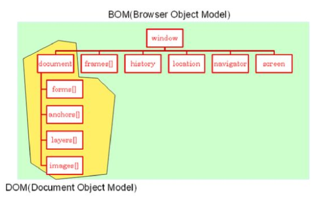

# DOM

> Document Object Model

* HTML 문서의 계층적인 구조를 트리로 표현한다.

## BOM

> Browser Object Model

* DOM을 포함하고 있는 model



## HTML요소 찾기

### ID를 이용

```javascript
var x = document.getElementById("main");
```

* `id="main"`을 가지는 요소를 찾는 코드

* 요소가 발견되면 `getElementById()`는 요소를 객체 형태로 반환하며 발견되지 않으면 null값을 반환

* 요소의 내용을 추출하기 위해선 `innerHTML` 속성을 사용한다.

  ```javascript
  alert(document.getElementById("main").innerHTML);
  ```

### 입력양식을 이용

```javascript
// 선언된 Tag의 순서를 이용하여
var x = document.forms[0].elements[0]

// name을 이용하여
var y = document.myform.text1
```

### Tag를 이용

```javascript
var eleArray = document.getElementsByTagName("div");
```

* `div`태그를 사용하는 모든 요소를 배열에 넣어서 반환

> 어떤 노드가 텍스트 데이터를 가지고 있으면, 텍스트 데이터는 첫 번째 자식 노드로 저장된다.

### DOM 트리 순회

> 자식 노드와 부모 노드 관계를 이용하여 한 노드씩 방문하는 방법

* `childNodes` : 한 요소의 모든 자식 요소에 접근 할 수 있으며, 배열을 반환
* `firstChild` : `childNodes` 배열의 첫 번째 자식노드 반환 (`=childNodes[0]`)
* `lastChild` : `childNodes` 배열의 마지막 자식  노드 반환 (`childNodes[childNodes.length - 1]`)

* `parentNode` : 현재 노드의 부모 노드를 반환
* `nextSibling` : 현재 노드의 다음 형제 노드를 반환
* `previousSibling` : 현재 노드의 이전 형제 노드를 반환